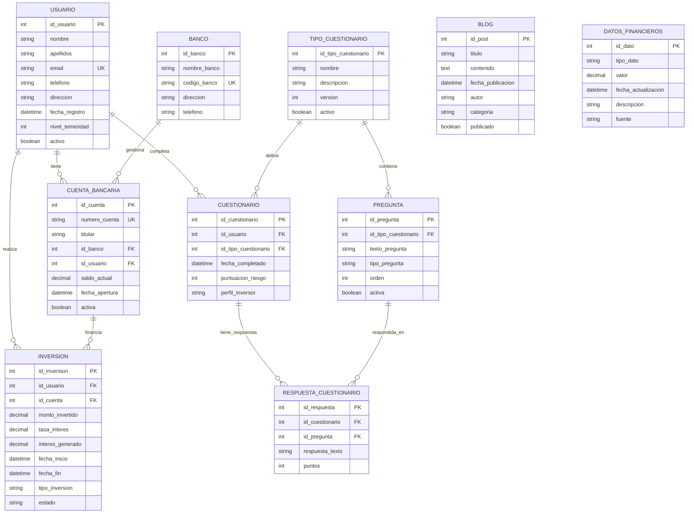

# Modelo Entidad-Relación - Dynamics Financial S.L

## Descripción General

Este modelo de base de datos soporta una aplicación web de inversiones donde los usuarios pueden:

- Registrarse con datos personales y financieros
- Gestionar múltiples cuentas bancarias
- Realizar un cuestionario de perfil de riesgo
- Ver y gestionar sus inversiones con cálculo de intereses
- Acceder a un blog corporativo

## Diagrama Entidad-Relación (Mermaid)

## Entidades Detalladas

### 1. USUARIO

Almacena la información de los clientes registrados en la plataforma.

**Atributos:**

- `id_usuario` (PK): Identificador único del usuario
- `nombre`: Nombre del usuario
- `apellidos`: Apellidos del usuario
- `email` (UK): Correo electrónico único
- `telefono`: Número de teléfono de contacto
- `direccion`: Dirección física del usuario
- `fecha_registro`: Fecha de alta en el sistema
- `nivel_temeridad`: Nivel de riesgo del usuario (resultado del cuestionario)
- `activo`: Indica si la cuenta está activa

**Relaciones:**

- 1:N con CUENTA_BANCARIA (un usuario puede tener múltiples cuentas)
- 1:1 con CUESTIONARIO (un usuario completa un cuestionario)
- 1:N con INVERSION (un usuario puede tener múltiples inversiones)

### 2. CUENTA_BANCARIA

Almacena las cuentas bancarias de los usuarios.

**Atributos:**

- `id_cuenta` (PK): Identificador único de la cuenta
- `numero_cuenta` (UK): Número de cuenta bancaria único
- `titular`: Nombre del titular de la cuenta
- `id_banco` (FK): Referencia al banco
- `id_usuario` (FK): Referencia al usuario propietario
- `saldo_actual`: Saldo disponible en la cuenta
- `fecha_apertura`: Fecha de registro de la cuenta
- `activa`: Indica si la cuenta está activa

**Relaciones:**

- N:1 con USUARIO (muchas cuentas pertenecen a un usuario)
- N:1 con BANCO (muchas cuentas pertenecen a un banco)
- 1:N con INVERSION (una cuenta puede financiar múltiples inversiones)

### 3. BANCO

Almacena información de las entidades bancarias.

**Atributos:**

- `id_banco` (PK): Identificador único del banco
- `nombre_banco`: Nombre de la entidad bancaria
- `codigo_banco` (UK): Código único del banco
- `direccion`: Dirección de la sede principal
- `telefono`: Teléfono de contacto

**Relaciones:**

- 1:N con CUENTA_BANCARIA (un banco gestiona múltiples cuentas)

### 4. INVERSION

Almacena las inversiones realizadas por los usuarios.

**Atributos:**

- `id_inversion` (PK): Identificador único de la inversión
- `id_usuario` (FK): Referencia al usuario inversor
- `id_cuenta` (FK): Referencia a la cuenta que financia la inversión
- `monto_invertido`: Cantidad invertida
- `tasa_interes`: Porcentaje de interés aplicado
- `interes_generado`: Interés acumulado hasta la fecha
- `fecha_inicio`: Fecha de inicio de la inversión
- `fecha_fin`: Fecha de finalización (nullable para inversiones activas)
- `tipo_inversion`: Tipo de producto de inversión
- `estado`: Estado actual (activa, finalizada, cancelada)

**Relaciones:**

- N:1 con USUARIO (muchas inversiones pertenecen a un usuario)
- N:1 con CUENTA_BANCARIA (muchas inversiones se financian desde una cuenta)

### 5. TIPO_CUESTIONARIO

Almacena los diferentes tipos o versiones de cuestionarios disponibles.

**Atributos:**

- `id_tipo_cuestionario` (PK): Identificador único del tipo de cuestionario
- `nombre`: Nombre del tipo de cuestionario
- `descripcion`: Descripción del propósito del cuestionario
- `version`: Versión del cuestionario
- `activo`: Indica si el tipo de cuestionario está activo

**Relaciones:**

- 1:N con CUESTIONARIO (un tipo puede ser usado en múltiples cuestionarios completados)
- 1:N con PREGUNTA (un tipo contiene múltiples preguntas)

### 6. CUESTIONARIO

Almacena el cuestionario de perfil de riesgo completado por cada usuario.

**Atributos:**

- `id_cuestionario` (PK): Identificador único del cuestionario completado
- `id_usuario` (FK): Referencia al usuario que lo completó
- `id_tipo_cuestionario` (FK): Referencia al tipo de cuestionario utilizado
- `fecha_completado`: Fecha de finalización del cuestionario
- `puntuacion_riesgo`: Puntuación total obtenida
- `perfil_inversor`: Perfil resultante (conservador, moderado, agresivo)

**Relaciones:**

- N:1 con USUARIO (un usuario puede completar múltiples cuestionarios)
- N:1 con TIPO_CUESTIONARIO (muchos cuestionarios completados usan un tipo)
- 1:N con RESPUESTA_CUESTIONARIO (un cuestionario tiene múltiples respuestas)

### 7. PREGUNTA

Almacena las preguntas del cuestionario de perfil de riesgo.

**Atributos:**

- `id_pregunta` (PK): Identificador único de la pregunta
- `id_tipo_cuestionario` (FK): Referencia al tipo de cuestionario al que pertenece
- `texto_pregunta`: Texto de la pregunta
- `tipo_pregunta`: Tipo de pregunta (opción múltiple, escala, etc.)
- `orden`: Orden de presentación de la pregunta
- `activa`: Indica si la pregunta está activa

**Relaciones:**

- N:1 con TIPO_CUESTIONARIO (muchas preguntas pertenecen a un tipo de cuestionario)
- 1:N con RESPUESTA_CUESTIONARIO (una pregunta puede ser respondida múltiples veces)

### 8. RESPUESTA_CUESTIONARIO

Almacena las respuestas individuales del cuestionario.

**Atributos:**

- `id_respuesta` (PK): Identificador único de la respuesta
- `id_cuestionario` (FK): Referencia al cuestionario
- `id_pregunta` (FK): Referencia a la pregunta
- `respuesta_texto`: Respuesta seleccionada por el usuario
- `puntos`: Puntos asignados a esta respuesta

**Relaciones:**

- N:1 con CUESTIONARIO (muchas respuestas pertenecen a un cuestionario)
- N:1 con PREGUNTA (muchas respuestas corresponden a una pregunta)

### 9. BLOG

Almacena las publicaciones del blog corporativo.

**Atributos:**

- `id_post` (PK): Identificador único del post
- `titulo`: Título de la publicación
- `contenido`: Contenido completo del post
- `fecha_publicacion`: Fecha de publicación
- `autor`: Nombre del autor
- `categoria`: Categoría del post
- `publicado`: Indica si está visible públicamente

**Relaciones:**

- Entidad independiente (no tiene relaciones con otras tablas)

### 10. DATOS_FINANCIEROS

Almacena datos financieros actualizados por Dynamics Financial.

**Atributos:**

- `id_dato` (PK): Identificador único del dato
- `tipo_dato`: Tipo de información financiera
- `valor`: Valor numérico del dato
- `fecha_actualizacion`: Fecha de última actualización
- `descripcion`: Descripción del dato
- `fuente`: Fuente de la información

**Relaciones:**

- Entidad independiente (no tiene relaciones con otras tablas)

## Cardinalidades

| Relación                              | Cardinalidad | Descripción                                        |
| ------------------------------------- | ------------ | -------------------------------------------------- |
| USUARIO - CUENTA_BANCARIA             | 1:N          | Un usuario puede tener múltiples cuentas bancarias |
| USUARIO - CUESTIONARIO                | 1:N          | Un usuario puede completar múltiples cuestionarios |
| TIPO_CUESTIONARIO - CUESTIONARIO      | 1:N          | Un tipo de cuestionario puede ser usado múltiples veces |
| TIPO_CUESTIONARIO - PREGUNTA          | 1:N          | Un tipo de cuestionario contiene múltiples preguntas |
| USUARIO - INVERSION                   | 1:N          | Un usuario puede realizar múltiples inversiones    |
| BANCO - CUENTA_BANCARIA               | 1:N          | Un banco gestiona múltiples cuentas                |
| CUENTA_BANCARIA - INVERSION           | 1:N          | Una cuenta puede financiar múltiples inversiones   |
| CUESTIONARIO - RESPUESTA_CUESTIONARIO | 1:N          | Un cuestionario contiene múltiples respuestas      |
| PREGUNTA - RESPUESTA_CUESTIONARIO     | 1:N          | Una pregunta puede ser respondida múltiples veces  |

## Restricciones de Integridad

1. **Claves Primarias (PK)**: Todas las entidades tienen un identificador único
2. **Claves Foráneas (FK)**: Mantienen la integridad referencial
3. **Claves Únicas (UK)**:
   - `email` en USUARIO
   - `numero_cuenta` en CUENTA_BANCARIA
   - `codigo_banco` en BANCO
4. **NOT NULL**: Campos obligatorios como nombres, fechas de registro, montos
5. **CHECK**:
   - `monto_invertido > 0`
   - `tasa_interes >= 0`
   - `nivel_temeridad BETWEEN 1 AND 10`

## Índices Recomendados

- `idx_usuario_email` en USUARIO(email)
- `idx_usuario_apellidos` en USUARIO(apellidos)
- `idx_cuenta_usuario` en CUENTA_BANCARIA(id_usuario)
- `idx_cuenta_banco` en CUENTA_BANCARIA(id_banco)
- `idx_inversion_usuario` en INVERSION(id_usuario)
- `idx_inversion_fecha` en INVERSION(fecha_inicio)
- `idx_blog_fecha` en BLOG(fecha_publicacion)

## Notas de Diseño

1. **Escalabilidad**: El modelo permite agregar nuevos tipos de inversiones sin modificar la estructura
2. **Auditoría**: Se incluyen campos de fecha para rastrear cambios
3. **Flexibilidad**: Las preguntas del cuestionario están normalizadas en una tabla separada, permitiendo agregar, modificar o desactivar preguntas sin afectar las respuestas históricas
4. **Reutilización**: La tabla PREGUNTA permite que las mismas preguntas sean utilizadas en múltiples cuestionarios
5. **Seguridad**: Los datos sensibles como cuentas bancarias están normalizados
6. **Performance**: Los índices optimizan las consultas más frecuentes (búsqueda por apellido, listados de inversiones)
7. **Integridad**: La constraint UNIQUE en RESPUESTA_CUESTIONARIO evita que un usuario responda la misma pregunta múltiples veces en un cuestionario
